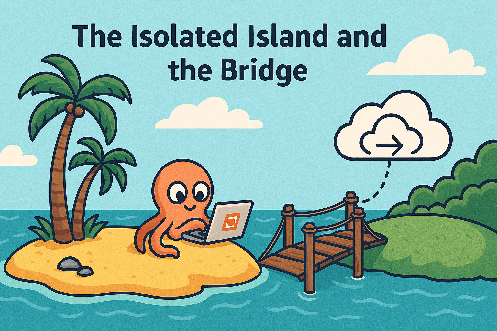
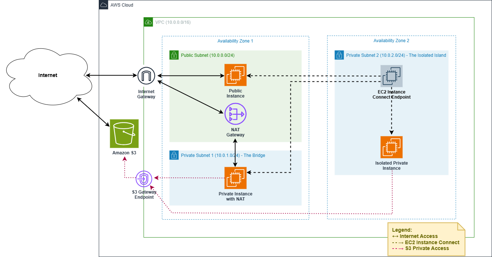

# 🌐 Démo AWS – Connectivité réseau VPC : "L’île isolée et le pont (édition avancée)"



## 🎯 Objectif de la démo

Cette démo avancée illustre une architecture complète de mise en réseau dans AWS avec Amazon VPC. Elle permet de :

* Visualiser les concepts de subnets publics et privés
* Comprendre le rôle d’une **NAT Gateway** pour l’accès sortant
* Utiliser un **EC2 Instance Connect Endpoint** pour accéder à une instance privée
* Tester la **connectivité inter-subnet**, l’accès Internet et les restrictions d’accès
* Appliquer des règles ICMP/SSH granulaires via des **groupes de sécurité**

---

## 🛠️ Composants déployés

* 1 VPC (paramétrable – par défaut `10.0.0.0/16`)
* 1 Subnet public
* 2 Subnets privés
* 1 NAT Gateway + Elastic IP dans le subnet public
* 1 EC2 Instance Connect Endpoint dans un subnet privé
* 1 groupe de sécurité distinct pour le EC2 Instance Connect avec autorisation sortante SSH vers le VPC CIDR
* 2 groupes de sécurité pour les instances EC2: 
    + ICMP: autorisation entrante depuis le VPC CIDR et votre adresse IP address
    + SSH: autorisation entrante depuis le groupe de sécurité pour EC2 Instance Connect
* 1 table de routage pour le subnet public
* 1 table de routage pour **Private Subnet 1** configurée avec la NAT Gateway pour l’accès sortant (le pont)
* 1 table de routage pour **Private Subnet 2** sans accès Internet sortant (l’île isolée).
* 1 Instance EC2 dans le Subnet public
* 1 Instance EC2 dans chaque Subnet privé



---

## ✋ Création manuelle (optionnelle)

1. Créer le VPC, les subnets, la NAT Gateway et l'Internet Gateway
2. Définir **trois** tables de routage :

   * Une pour le subnet public avec une route vers l’Internet Gateway
   * Une pour le subnet privé 1 **sans route vers Internet**
   * Une pour le subnet privé 2 **avec une route par défaut via la NAT Gateway**
3. Associer chaque subnet à sa table de routage
4. Créer un groupe de sécurité pour le EIC avec autorisation sortante SSH vers le VPC CIDR
5. Créer les groupes de sécurité ICMP et SSH pour les EC2
    + ICMP: autorisation entrante depuis le VPC CIDR et votre adresse IP address
    + SSH: autorisation entrante depuis le groupe de sécurité pour EC2 Instance Connect
6. Créer une Key Pair pour la connexion SSH aux instances EC2
7. Lancer 3 instances EC2 Amazon Linux 2023 (t3.micro)
8. Créer l’EC2 Instance Connect Endpoint dans le **subnet privé 2**
9. Attribuer les bons SG aux instances et au EIC

---

## ⚙️ Creation via CloudFormation

```bash
aws cloudformation deploy \
  --template-file vpc_connectivity_demo_cfn.yaml \
  --stack-name vpc-connectivity-demo \
  --capabilities CAPABILITY_NAMED_IAM \
  --parameter-overrides VpcCidr=10.0.0.0/16 PingCidr=203.0.113.42/32 Environment=demo EC2ConnectIPv4PrefixId=pl-xxxxx
```

---

## ⚙️ Creation via Terraform

```bash
terraform init
terraform apply \
  -var="vpc_cidr=10.0.0.0/16" \
  -var="ping_cidr=203.0.113.42/32"
```

---

## 🧪 Scenarios de Test

Tests: 
   * Connexion aux instances via la console AWS grâce à l’EC2 Instance Connect
   * ping entre les instances (succès attendu)
   * `ping` www.amazon.com depuis l’instance public vers Internet (succès attendu)
   * `ping` www.amazon.com depuis l’instance privée 1 vers Internet (succès attendu)
   * `ping` www.amazon.com depuis l’instance privée 2 vers Internet (échec attendu)

---

## 🧹 Nettoyage des ressources

### CloudFormation

```bash
aws cloudformation delete-stack --stack-name vpc-connectivity-demo
```

### Terraform

```bash
terraform destroy \
  -var="vpc_cidr=10.0.0.0/16" \
  -var="ping_cidr=203.0.113.42/32"
```

---

Cette démo constitue un **excellent exercice de synthèse réseau AWS**, combinant théorie, sécurité et expérimentation concrète sur des subnets isolés et connectés.
