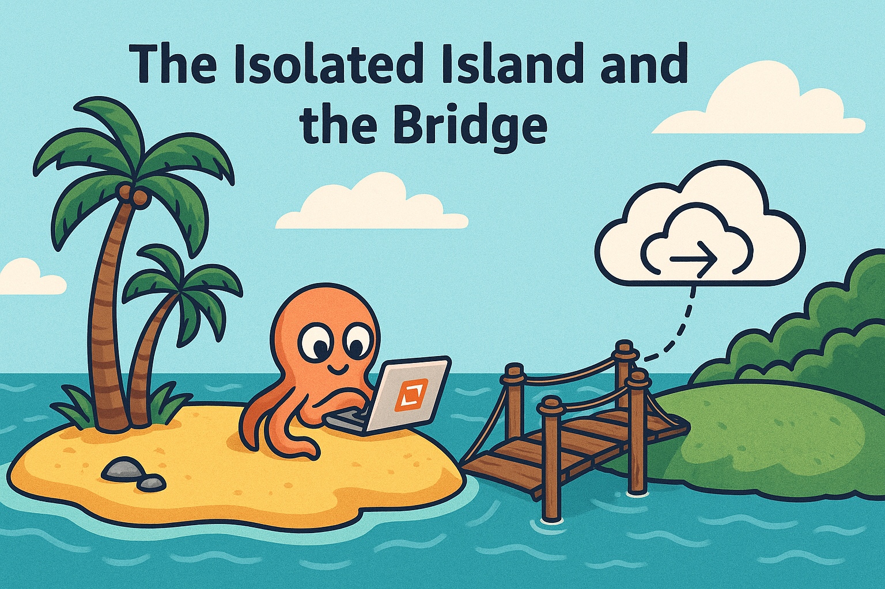
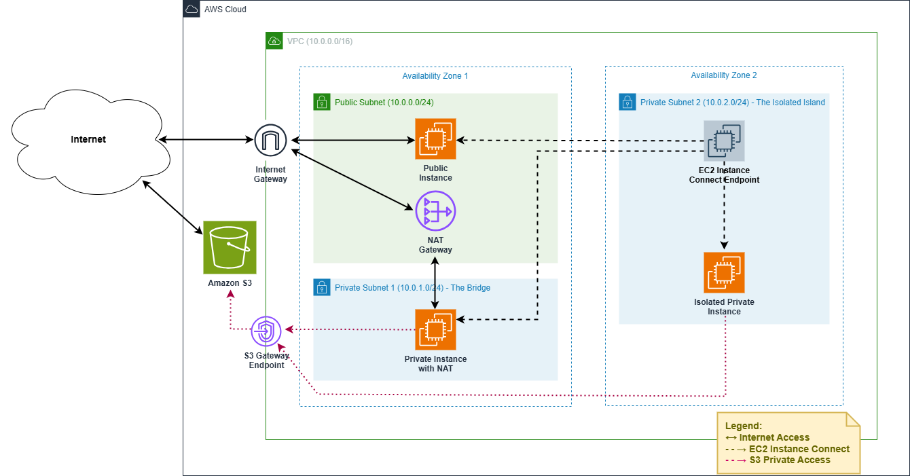

# 🌐 AWS Demo – VPC Connectivity: "The Isolated Island and the Bridge (Advanced Edition)"



## 🎯 Demo Objective

This advanced demo illustrates a complete network architecture using **Amazon VPC**. It aims to:

* Visualize the concept of public and private subnets
* Understand the role of a **NAT Gateway** for outbound Internet access
* Use an **EC2 Instance Connect Endpoint** to access a private EC2 instance
* Test **inter-subnet connectivity**, Internet access, and access restrictions
* Apply granular ICMP/SSH rules using **security groups**

---

## 🛠️ Deployed Components

* 1 VPC (parameterized – default `10.0.0.0/16`)
* 1 Public subnet
* 2 Private subnets
* 1 NAT Gateway + Elastic IP in the public subnet
* 1 EC2 Instance Connect Endpoint in one private subnet
* 1 separate security group for the EC2 Instance Connect with outbound SSH to VPC CIDR 
* 2 security groups for EC2 instances: 
    + ICMP: Inbound from VPC CIDR and your own IP address
    + SSH: Inbound from EC2 Instance Connect security group
* 1 route table for the public subnet
* 1 route table for **Private Subnet 1** with default route via NAT Gateway (the bridge)
* 1 route table for **Private Subnet 2** with no outbound Internet access (the isolated island)
* 1 EC2 Instance in the Public subnet
* 1 EC2 Instance in each private subnet



---

## ✋ Manual Setup (Optional)

1. Create the VPC, subnets, NAT Gateway, and Internet Gateway
2. Define **three** route tables:

   * One for the public subnet with a route to the Internet Gateway
   * One for private subnet 1 **with no Internet route**
   * One for private subnet 2 **with a default route via the NAT Gateway**
3. Associate each subnet with its corresponding route table
4. Create a separate security group for the EIC with outbound SSH allowed
5. Create ICMP and SSH security groups for EC2 instances
    + ICMP: Inbound from VPC CIDR and your own IP address
    + SSH: Inbound from EC2 Instance Connect security group
6. Create an SSH Key Pair to connect into the instances
7. Launch 3 EC2 instances (Amazon Linux 2023, t3.micro)
8. Create the EC2 Instance Connect Endpoint in **Private Subnet 2**
9. Attach the appropriate security groups to EC2 instances and the EIC

---

## ⚙️ Deploy via CloudFormation

```bash
aws cloudformation deploy \
  --template-file networking-demo.yaml \
  --stack-name vpc-connectivity-demo \
  --capabilities CAPABILITY_NAMED_IAM \
  --parameter-overrides VpcCidr=10.0.0.0/16 PingCidr=203.0.113.42/32 Environment=demo 
```

---

## ⚙️ Deploy via Terraform

```bash
terraform init
terraform apply \
  -var="vpc_cidr=10.0.0.0/16" \
  -var="ping_cidr=203.0.113.42/32"
```

---

## 🧪 Scenarios to Test

Tests:  
   * Connect to each EC2 instance using EC2 Instance Connect 
   * ping between EC2 instances (expected to succeed)
   * `ping` www.amazon.com from Public Instance to Internet (expected to succeed)
   * `ping` www.amazon.com from Private Instance 1 to Internet (expected to succeed)
   * `ping` www.amazon.com  from Private Instance 2 to Internet (expected to fail)

---

## 🧹 Cleanup

### CloudFormation

```bash
aws cloudformation delete-stack --stack-name vpc-connectivity-demo
```

### Terraform

```bash
terraform destroy \
  -var="vpc_cidr=10.0.0.0/16" \
  -var="ping_cidr=203.0.113.42/32"
```

---

This demo is an **excellent AWS networking exercise**, combining theory, security, and hands-on testing across isolated and connected subnets.
